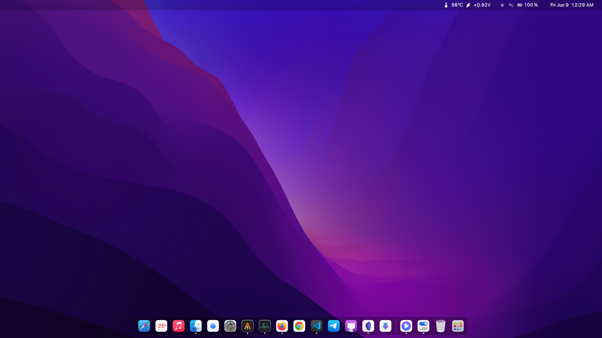
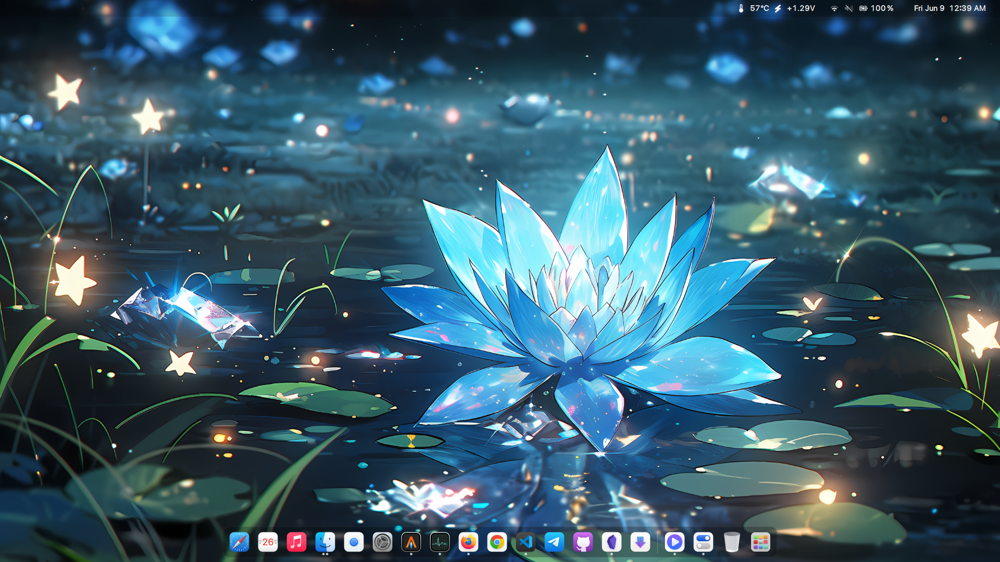
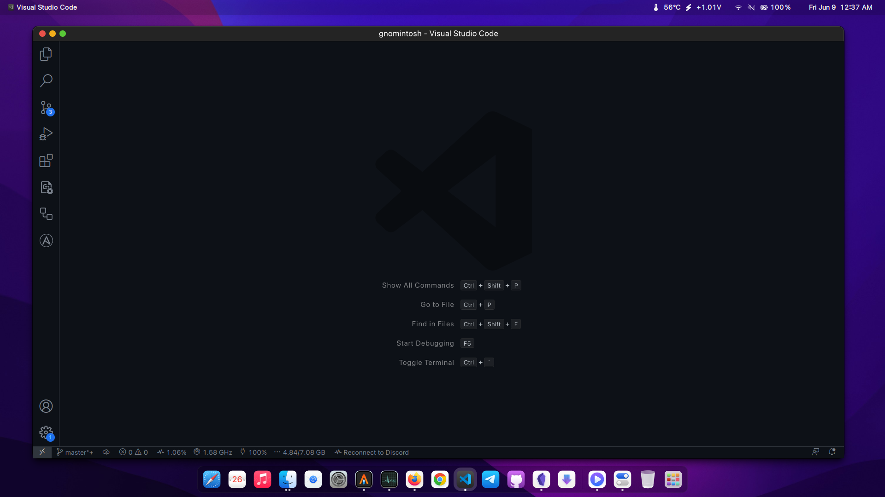
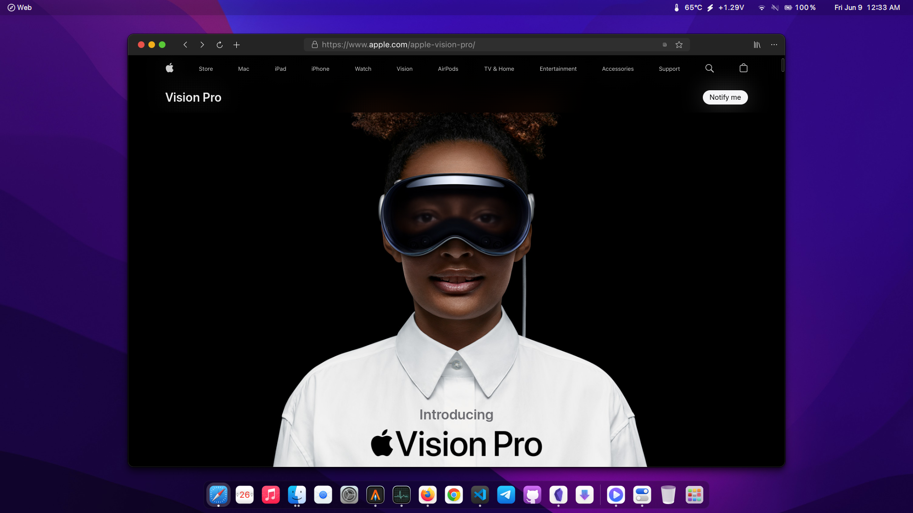

<div align="center">
</img>
</div>

# Gnomintosh
Gnomintosh is a macOS-inspired theme for the GNOME desktop environment, bringing a familiar look and feel to your Linux system. It includes dconf configurations, themes, icons, cursors, wallpapers, and fonts to provide a comprehensive visual experience.

## Table of contents
- [Screenshots](#screenshots)
- [Features](#features)
- [Requirements](#requirements)
  - [Required Packages](#required-packages)
  - [Required GNOME Extensions](#required-gnome-extensions)
- [Installation](#installation)
- [Updates](#updates)
- [Usage](#usage)
- [For XFCE Users](#for-xfce-users)
- [Contribute](#contribute)
- [Credits](#contribute)

## Screenshots





## Features

- MacOS-inspired design elements and aesthetics.
- Consistent theme for GNOME applications.
- Customizable dock and top bar.
- Stylish icons and cursors.
- Fully automated script for easy installation
- Collection of wallpapers which suitable for this theme.
- Regular updates and bug fixes

## Requirements
## Required Packages
Before installing and applying the Gnomintosh theme, ensure that the following requirements are met:

- GNOME desktop environment is installed.
- The dconf editor, GNOME Tweaks, GNOME Extentions is installed. If it's not already installed, follow the instructions below based on your Linux distribution:

### Debian/Ubuntu
To install on Debian or Ubuntu, open a terminal and run the following command:
```bash
sudo apt update
sudo apt install dconf-editor gnome-tweaks gnome-shell-extensions
```
### Fedora
To install on Fedora, open a terminal and run the following command:
```bash
sudo dnf install dconf-editor gnome-tweaks gnome-shell-extension
```

### Arch Linux
To install on Arch Linux, open a terminal and run the following command:
```bash
sudo pacman -Syu dconf gnome-tweaks gnome-shell-extensions
```

## Required GNOME Extensions
Make sure the following GNOME extensions are installed:
- [Dash to Dock](https://extensions.gnome.org/extension/307/dash-to-dock/)
- [Freon](https://extensions.gnome.org/extension/841/freon/)
- [Just Perfection](https://extensions.gnome.org/extension/3843/just-perfection/)

You can install these extensions by visiting the respective links and following the installation instructions provided on the GNOME Extensions website.

For more information, refer to the [GNOME Shell Integration](https://wiki.gnome.org/action/show/Projects/GnomeShellIntegration/Installation) page.

## Installation
Please follow these steps to install and apply the Gnomintosh theme:

1. Clone or download the repository to your local machine.
```bash
git clone https://github.com/jothi-prasath/gnomintosh.git
```
2. Navigate to the cloned repository directory.
```bash
cd gnomintosh
```
3. Install the necessary [Required packages](#required-packages) and [Required extentions](#required-gnome-extensions)
4. Run the following command
```bash
./main.sh
```
This script will guide you through the installation of the theme, icons, cursors, wallpapers, and fonts.

Note: By default, the wallpapers are installed in the Pictures folder in your home directory.

## Updates
Gnomintosh is a project that is actively maintained and improved. Updates are regularly released to ensure compatibility with the latest GNOME versions and address any reported bugs or issues. It is recommended to regularly update and apply the latest version of the theme to benefit from the latest enhancements and bug fixes.

To update the Gnomintosh theme, simply go to the repository folder, pull the latest changes from the GitHub repository and re-run the installation script:
```bash
git pull
./install.sh
```

## Usage
Once the Gnomintosh theme is installed, you can customize your GNOME desktop environment to match the style. Here are some recommended configurations:
- Adjust the Dash to Dock settings to customize the dock appearance and behavior.
- Configure the Top Bar Organizer extension to organize and manage the top bar elements.
- Set your preferred Gnomintosh wallpaper from the provided collection.

Feel free to explore and experiment with different configurations to personalize your desktop experience.

## For XFCE Users
If you are using the XFCE desktop environment, you can check out my other project, [SmallSur](https://github.com/jothi-prasath/SmallSur). SmallSur provides a macOS-inspired theme specifically designed for XFCE. It includes themes, icons, and other customization elements to give your XFCE desktop a sleek and modern look.

<p align="center"> <a href="https://github.com/jothi-prasath/SmallSur">

</a> </p>

## Star


## Contribute
Contributions are welcome! If you would like to contribute to Gnomintosh, please follow these guidelines:

1. Fork the repository.
2. Make your modifications.
3. Test thoroughly.
4. Submit a pull request.

Please ensure that your contributions align with the project's goals and follow any existing coding conventions.

## Credits
GTK Theme - https://github.com/vinceliuice/WhiteSur-gtk-theme

Icon - https://github.com/vinceliuice/WhiteSur-icon-theme

Cursor - https://github.com/vinceliuice/WhiteSur-cursors
